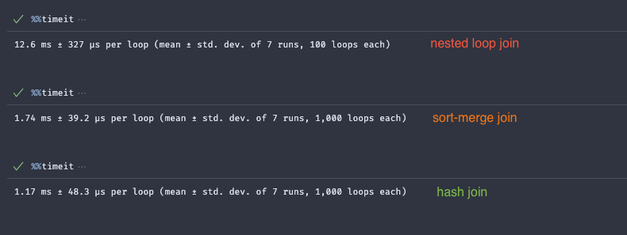

# Primer Task

This script was created as take-home assignment, its purpose is to load and transform a JSON file, then load into a SQLite database (`metrics.db`) in a table called `metrics`.

## Usage
Run the script using `python`. No need to install extra libraries.

```console
$ python main.py
```
## Example 
```console
$ python main.py

Primer Task - Starting execution
Primer Task - Loading data from: ./wal.json
Primer Task - Data loaded. 1000 records found.
Primer Task - Transforming data...
Primer Task - Data transformed.
Primer Task - Processing metrics table...
Primer Task - Metrics table processed. Resulting 529 rows.
Primer Task - Creating table if non existent
Primer Task - Inserting rows into the database
Primer Task - Rows loaded into the database with success.
Primer Task - Finished execution
```
A database called `metrics.db` will be created in the root folder.

## Dataset
The dataset used in this application can found in the root folder: `./wal.json`

## Candidate Notes
### Join
Initially, I approached the dictionary join using a simple `nested loop join`. It didn't look good in my opinion, so I spent some time investigating some alternatives: `sort-merge join` and `hash join`. Implemented both approaches and then compared the execution time. The `Hash Join` performed better in this situation, so I choose it for my final solution.



### Null columns
I could not find valid entries for some of the required metrics columns, for instance `payment_instrument_token_data.vault_data.customer_id`, the column `payment_instrument_token_data.vault_data` seems to be always `null`.